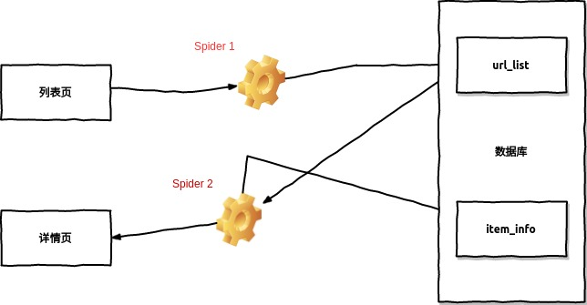
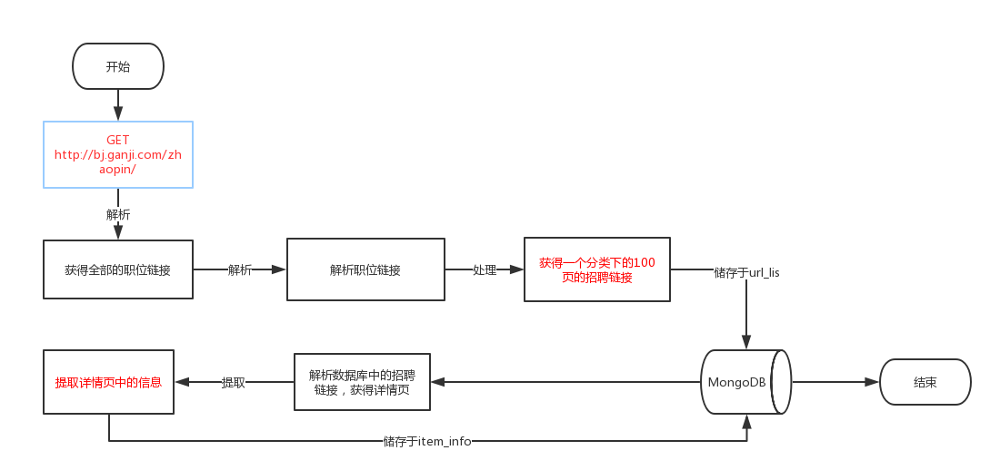
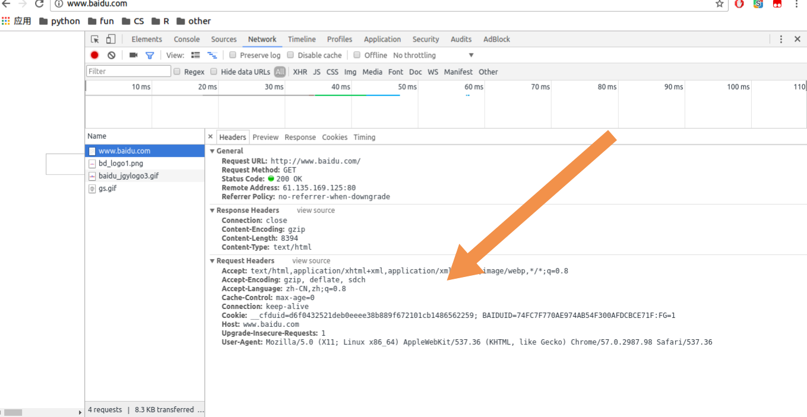
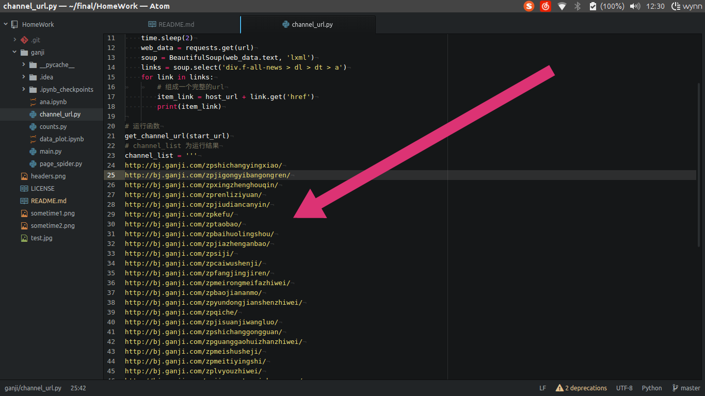
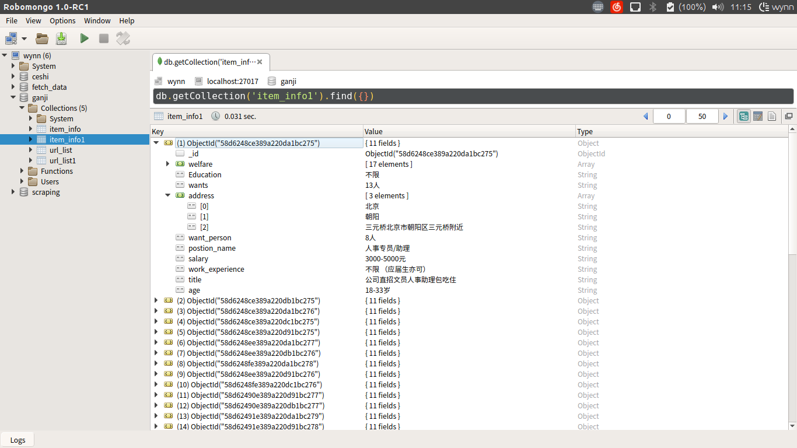
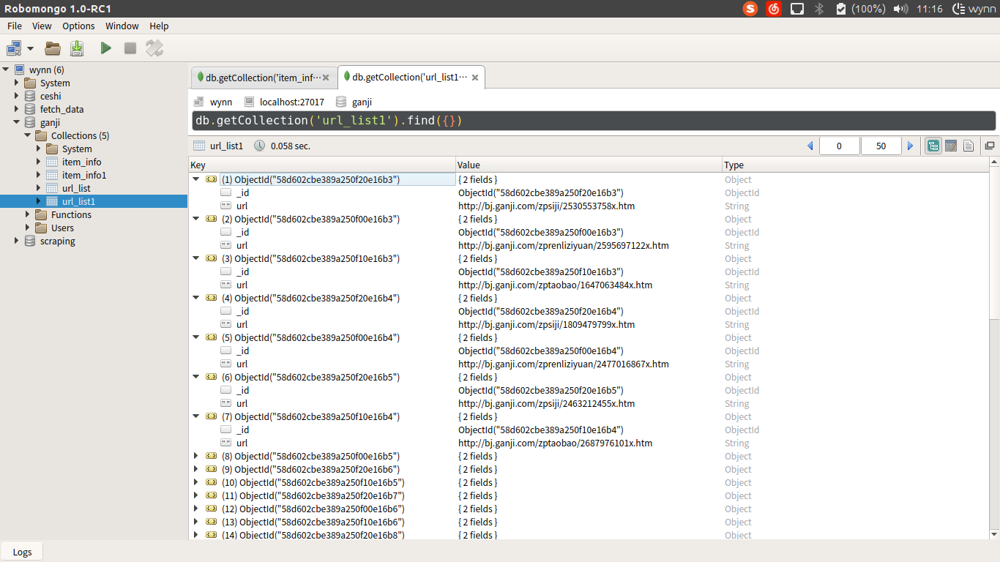

# spider
赶集网的爬虫，爬取赶集网上的招聘的板块上的信息并储存。
*算是以深度优先来进行爬取*

*爬虫的目的是收集数据，数据的格式要便于处理和分析。*

## 依赖

- MongoDB
- requests
- pymongo
- BeautifulSoup and lxml

## 关于爬虫

### 准备

1. 确定已安装MongoDB，Python3.5, 浏览器建议使用Chrome。
2. 安装需要的Python的第三方库:

	```
	在 terminal(cmd) 中输入：

	win:

	pip install requests, BeautifulSoup4, pymongo, lxml

	linux:

	sudo pip3 install requests, BeautifulSoup4, pymongo, lxml

	```

3. 如果你知道更好：
	- 一点 HTML CSS HTTP and MongoDB

### 整体结构



- Spider 1 从[列表页](http://bj.ganji.com/zhaopin/)中获取页面下全部的个分类的链接，然后将分类的链接储存到 url_list 这个collection中。

- Spider 2 从url_list 中获取储存的链接并解析，获取链接的详情页，将详情页中的想要抓取的信息储存到 item_info 中。

### 流程图



### 代码

### 首先要观察爬取网站的页面结构

- 首先从[起始页](http://bj.ganji.com/zhaopin/)来看，我的目的是将其中的 销售， 行政， 后勤等这样的类别的链接提取出来。
- 其次到这样的[类别页](http://bj.ganji.com/zpshichangyingxiao/)中， 我的目的是将 所有招聘职位的链接 爬取下来并储存到url_list表中，
- 然后从数据库url_list表中，迭代其中的链接，解析出[详情页](http://bj.ganji.com/zpfangjingjiren/2593320747x.htm)，提取出我想要的信息。就是这样一步一步的深入它的页面结构

### channel_url文件 将招聘板块中的招聘职位分类的链接提取出来。


这里的 [requests](http://docs.python-requests.org/zh_CN/latest/index.html) 的作用:
> Requests 唯一的一个非转基因的 Python HTTP 库，人类可以安全享用。
> *警告：非专业使用其他 HTTP 库会导致危险的副作用，包括：安全缺陷症、冗余代码症、重新发明轮子症、啃文档症、抑郁、头疼、甚至死亡。*

requests 的基本用法:

```
import requests
# 发起get请求
data = requests.get('http://www.baidu.com')
# 打印data
print(data.text)
# .....
# 其中还可以设置 headers and proxies
# headers 是访问一个网站的头部信息， 通常在可在 chrome的开发者工具中看到
# 如 chrome: 检查 > network > headers
# 使用headers 浏览器请求的头部
# 由于网站可能限制了一个ip访问的频率，所以使用代理ip
wed = requests.get('http://www.bing.com', headers=headers, proxies=proxies)

```
*关于代理ip* 可以在 http://cn-proxy.com/ 找到， 当然也可以写一个爬虫，将代理爬下来,*其实有种东西叫代理池*.

有关http的头字段可以参见 [http头字段](https://zh.wikipedia.org/wiki/HTTP%E5%A4%B4%E5%AD%97%E6%AE%B5%E5%88%97%E8%A1%A8)

*headers 的位置*：


这里的 BeautifulSoup and lxml的作用：
> Beautiful Soup 是一个可以从HTML或XML文件中提取数据的Python库, 这里我使用 lxml 来解析。

[BeautifulSoup](https://www.crummy.com/software/BeautifulSoup/bs4/doc.zh/#) 的基本用法：

```
from bs4 import BeautifulSoup
# 以下是一个非常经典的写法，其中 data.text是做汤的原料， lxml 是菜谱，BeautifulSoup 将其做成
soup = BeautifulSoup(data.text, 'lxml')
# BeautifulSoup 有 select and find 两种提取信息的方式
# select 用的是css选择器
img = soup.select('#lg > img')
# find 方法可以根据标签和属性来提取信息
img = soup.find('img', {'hidefocus': "true"})
# 此外 find 还有 findAll() and find_all() 方法 可参见文档

```
channel_url 中定义了一个函数， 来进行获取链接，我这里将运行的结果，赋给了channel_list, 当然也可以放进数据库。


### page_spider 是进行爬取的主要文件， 其中定义两个函数，是进行爬取信息的两个爬虫。

这里的 pymongo:
> PyMongo is a Python distribution containing tools for working with MongoDB, and is the recommended way to work with MongoDB from Python. This documentation attempts to explain everything you need to know to use PyMongo.

pymongo 的基本用法：

```
import pymongo
# 连接pymongo
client = pymongo.MongoClient('localhost', 27017)
# 连接到数据库
ganji = client['ganji']
# 连接到数据库中的一个表(集合)
url_list = ganji['url_list']
# pymongo 的一些方法: 单个插入数据
url_list1.insert_one({'url': url})
# 对数据库中的数据进行计数
url_list1.find().count()

```
关于 *正则表达式*：
python 中的正则表达式为 re模块， 基本用法：

```
import re
# 进行正则匹配
href = re.complie('^(https?://)?bj\.ganji\.com.*\.htm')
# 把正则表达式编译成一个正则表达式对象, 来匹配 href

```
正则表达式可以参见：[正则表达式](http://www.runoob.com/python/python-reg-expressions.html)

正则表达式的测试网站：[PyRegex](http://www.pyregex.com/)

#### 函数 get_link_form：

1. url_views 是对其url 的观察构造的，例如 http://bj.ganji.com/zpshichangyingxiao/o3/ 为其第三页的url， 我将其写成 url_views = '{0}o{1}/'.format(channel, str(page)) ， channel 和 page 为这个函数的参数

2. 我的计划是爬去100页， 但是有的页面可能没有100页， 用if来判断是否有要爬去的信息，有则爬，无则pass， 具体的判断的依据是 *每个页面下都会有的 下一页的选项*。

3. 由于findAll所返回的对象是一个列表，所以用for循环来进行迭代并储存。


#### 函数get_item_info：

1. 与上一个函数相似，这个主要是将每一个职位招聘的详情信息，提取并储存。但是要判断一下，这个商品是否已经成交或者下架，如果成交或者下架，那么访问这个页面时状态码应该返回 404. 所以用if判断状态码来进行爬去。

### main 文件主要是调用page_spider的爬虫进行爬取

multiprocessing 为python的多进程模块，采用多进程爬取。

```
from multiprocessing import Pool
# 如果要启动大量的子进程，可以用进程池的方式批量创建子进程
pool = Pool(4)
for link in url_list1.find({}, {'_id': 0, 'url': 1}):
		pool.apply(get_item_info, args=(link['url'],))
pool.close()
pool.join()
# pool = Pool(4) 就可以运行 4 个进程， Pool的默认大小是CPU的核数
# 对Pool对象调用join()方法会等待所有子进程执行完毕，调用join()之前必须先调用close()，调用close()之后就不能继续添加新的Process了
# map 函数是一个语法糖， map 函数接受两个参数， 一个序列， 一个函数， 并把结果通过Iterator(迭代器)返回
test = map(lambda x: x*x, [1, 2, 3, 4, 5, 6, 7, 8, 9])
test 为 <map object at 0x7f998e02c7b8>
list(test)
[1, 4, 9, 16, 16, 25, 36, 49, 64, 81]

```
###  count 文件主要是在main.py 运行时， 每5秒来检查一次数据库中数据的数量。

#### 效果图




## 爬取结果

我的MongoDB中， 其中 url_list的 count 为:*120166*, item_info的 count为:*30726*.

可能是我url_list先于item_info爬取，url_list有些链接已经失效。

## 体会

我之前写过58同城的爬虫和这个类似， 但是写这个的时候bug明显更多。

不同的网站会有不同的抓取策略。

*写爬虫会有很多的坑，验证码，JavaScript，模拟登录等都是要克服的。*

还有一些网站的数据加载方式， 比如美团，美团的数据加载使用的是 ajax(异步加载JavaScript和XML)，用selenium虽然可以,但是效率低。抓包分析效率高，但是很难模仿请求。我比较偏于分析请求。所以要了解网站的一些常见的反爬措施和网页的结构。

赶集网这种网站页面结构很适合爬取， 但是它对同一ip的访问频率会有限制。

这个程序的效率还可以优化，*例如 使用 lxml 来解析网页， 速度会快大概10倍的样子， 还可以利用 异步非阻塞 优化， *虽然我不会。 我会继续学习的。**

# 附加内容

> 我觉得的我在工作室的角色：类似于Dota2中的4号位*(游走或者野区发育)* .
> 我更希望打3号位*(Gank位)*.
